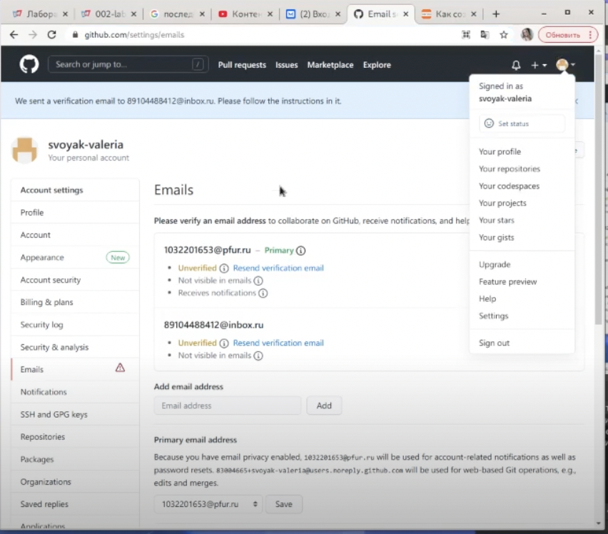
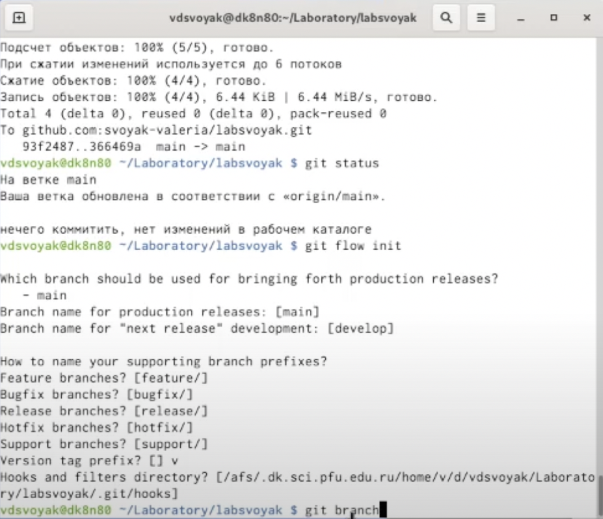

---
# Front matter
lang: ru-RU
title: "Отчёт по лабораторной работе 3 "
subtitle: "(лаб 2 переделанная в маркдаун)"
author: "Свояк Валерия Дмитриевна"

# Formatting
toc-title: "Содержание"
toc: true # Table of contents
toc_depth: 2
lof: true # List of figures
lot: true # List of tables
fontsize: 12pt
linestretch: 1.5
papersize: a4paper
documentclass: scrreprt
polyglossia-lang: russian
polyglossia-otherlangs: english
mainfont: PT Serif
romanfont: PT Serif
sansfont: PT Sans
monofont: PT Mono
mainfontoptions: Ligatures=TeX
romanfontoptions: Ligatures=TeX
sansfontoptions: Ligatures=TeX,Scale=MatchLowercase
monofontoptions: Scale=MatchLowercase
indent: true
pdf-engine: lualatex
header-includes:
  - \linepenalty=10 # the penalty added to the badness of each line within a paragraph (no associated penalty node) Increasing the value makes tex try to have fewer lines in the paragraph.
  - \interlinepenalty=0 # value of the penalty (node) added after each line of a paragraph.
  - \hyphenpenalty=50 # the penalty for line breaking at an automatically inserted hyphen
  - \exhyphenpenalty=50 # the penalty for line breaking at an explicit hyphen
  - \binoppenalty=700 # the penalty for breaking a line at a binary operator
  - \relpenalty=500 # the penalty for breaking a line at a relation
  - \clubpenalty=150 # extra penalty for breaking after first line of a paragraph
  - \widowpenalty=150 # extra penalty for breaking before last line of a paragraph
  - \displaywidowpenalty=50 # extra penalty for breaking before last line before a display math
  - \brokenpenalty=100 # extra penalty for page breaking after a hyphenated line
  - \predisplaypenalty=10000 # penalty for breaking before a display
  - \postdisplaypenalty=0 # penalty for breaking after a display
  - \floatingpenalty = 20000 # penalty for splitting an insertion (can only be split footnote in standard LaTeX)
  - \raggedbottom # or \flushbottom
  - \usepackage{float} # keep figures where there are in the text
  - \floatplacement{figure}{H} # keep figures where there are in the text
---

# Цель работы

Изучить идеологию и применение средств контроля версий (в лабораторной 2)

Научиться оформлять отчёты с помощью легковесного языка разметки Markdown (в лабораторной 3)

# Задание

Лабораторная работая вляется небольшой научно-исследовательской работой,которую и оформлять следует по всем утверждённым требованиям.При подготовке отчета по лабораторной работе вы освоите ряд важных элементов,которые вдальнейшем пригодятся вам при написании курсовой и дипломной работы.

# Выполнение лабораторной работы

## Настройка git

{width=70%}

Создайте учётную запись на https://github.com.

{width=70%}

Настройте систему контроля версий git, как это описано выше c использованием сервера репозиториев https://github.com/. 

Создаем публичный репозиторий на гитхаб 1

{width=70%}

Появился

**Устанавливаем ключ для связи**

{width=70%}

Заходим в настройки гитхаб и в установку SSH ключей

{width=70%}

Прописываем команду cd.ssh для перехода в каталог и генерируем публичный и приватный ключи ssh-keygen -C “Свояк Валерия <89104488412@inbox.ru>”

{width=70%}

Убедились, что ключ появился:

{width=70%}

**Чтобы вставить ключ в гетхаб, нам нужно получить на него ссылку. Для этого воспользуемся текстовым редактором. На фото можно видеть, как мы выбрали публичный ключ и открыли его с помощью текстового редактора**

{width=70%}

**Вставляем ссылку на гитхаб**

{width=70%}

**Ключ установился**

{width=70%}

{width=70%}

**Создаем каталог лаборатория и клонируем в него наш ключ**

{width=70%}

**Посмотрим, какие файлы есть в каталоге**

**Чтобы создать первый коммит, изменим содержание файла README.md. Для этого:**

{width=70%}

В текстовый документ добавляем фразу «Что-то новое» с помощью команды echo

{width=70%}

Текст добавился 

{width=70%}

Можем просмотреть это через команду cat 

**Изменения произошли, можно создавать коммит. Для этого:**

{width=70%}

- Используем команду git commit -m “first commit”

- Используя команду git config –global user.name вводим почту и имя

- Устанавливаем коммит командой git commit -m “first commit”

{width=70%}

Добавляем файл README.cd и с помощью команды git push передаем данные в гетхаб

{width=70%}

Коммит появился

## Теперь делаем первичную конфигурацию – создаем лицензию:

{width=70%}

Вставляем файл лицензии - wget https://creativecommons.org/licenses/by/4.0/legalcode.txt 

{width=70%}

Добавляем шаблон игнорируемых файлов curl -L -s https://www.gitignore.io/api/list

{width=70%}

Скачиваем шаблон и добавим все файлы (git add .)

{width=70%}

Устанавливаем второй коммит

{width=70%}

И отправляем его на гитхаб

{width=70%}

Проверяем – они появились

## Конфигурация git flow

{width=70%}

Инициализируем git-flow: git flow init

Префикс для ярлыков установим в v. 

{width=70%}
{width=70%}

Проверьте,что Вы на ветке develop: git branch 

{width=70%}

Создадим релиз с версией 1.0.0 -  git flow release start 1.0.0

{width=70%}

Запишем версию:   echo "1.0.0" >> VERSION

{width=70%}

Добавим в индекс: git add . git commit -am 'chore(main): add version'

{width=70%}

Зальём релизную ветку в основную ветку: git flow release finish 1.0.0

{width=70%}

Отправим данные на github: git push --all; git push –tags

{width=70%}

Создадим релиз на github (появились ветки и в них файлы)

Ответы на контрольные вопросы:

1. Система управления версиями - ПО для облегчения работы с изменяющейся информацией. Система управления версиями позволяет хранить несколько версий одного и того же документа, при необходимости возвращаться к более ранним версиям, определять, кто и когда сделал то или иное изменение, и многое другое.

2. Основным понятием VCS является репозиторий (repository) – специальное хранилище файлов и папок проекта, изменения в которых отслеживаются. В распоряжении разработчика имеется так называемая “рабочая копия” (working copy) проекта, с которой он непосредственно работает. Рабочую копию необходимо периодически синхронизировать с репозиторием, эта операция предполагает отправку в него изменений, которые пользователь внес в свою рабочую копию (такая операция называется commit) и актуализацию рабочей копии, в процессе которой к пользователю загружается последняя версия из репозитория (этот процесс носит название update).

3. Централизованная, предусматривающая концентрацию функций в рамках единой службы материально-технического обеспечения. 

Децентрализованная, предусматривающая осуществление МТО бизнес единицами самостоятельно. 

Смешанная форма организации материально-технического обеспечения, состоящая в комбинирования указанных выше способов.

6. Система контроля версий ГИТ представляет собой набор программ командной строки.

Доступ к ним можно получить из терминала посредством ввода команды гит с различными опциями.

7. git add

Команда git add добавляет содержимое рабочей директории в индекс (staging area) для последующего коммита. По умолчанию git commit использует лишь этот индекс, так что вы можете использовать git add для сборки слепка вашего следующего коммита.

git status

Команда git status показывает состояния файлов в рабочей директории и индексе: какие файлы изменены, но не добавлены в индекс; какие ожидают коммита в индексе. Вдобавок к этому выводятся подсказки о том, как изменить состояние файлов.

git commit

Команда git commit берёт все данные, добавленные в индекс с помощью git add, и сохраняет их слепок во внутренней базе данных, а затем сдвигает указатель текущей ветки на этот слепок.

git branch

Команда git branch — это своего рода “менеджер веток”. Она умеет перечислять ваши ветки, создавать новые, удалять и переименовывать их.

9. Ветка в Git'е — это просто «скользящий» указатель на один из коммитов. Когда вы создаёте новые коммиты, указатель ветки автоматически сдвигается вперёд, к вновь созданному коммиту.

10. Игнорируемые файлы обычно представляют собой файлы, специфичные для платформы, или автоматически созданные из сборочных систем. 
Файл .gitignore указывает, какие неотслеживаемые файлы должен игнорировать Git .

# Выводы

Изучила идеологию и применение средств контроля версий (во 2 лабораторной)
Научилась оформлять отчёты с помощью легковесного языка разметки Markdown (в лабораторной 3)
