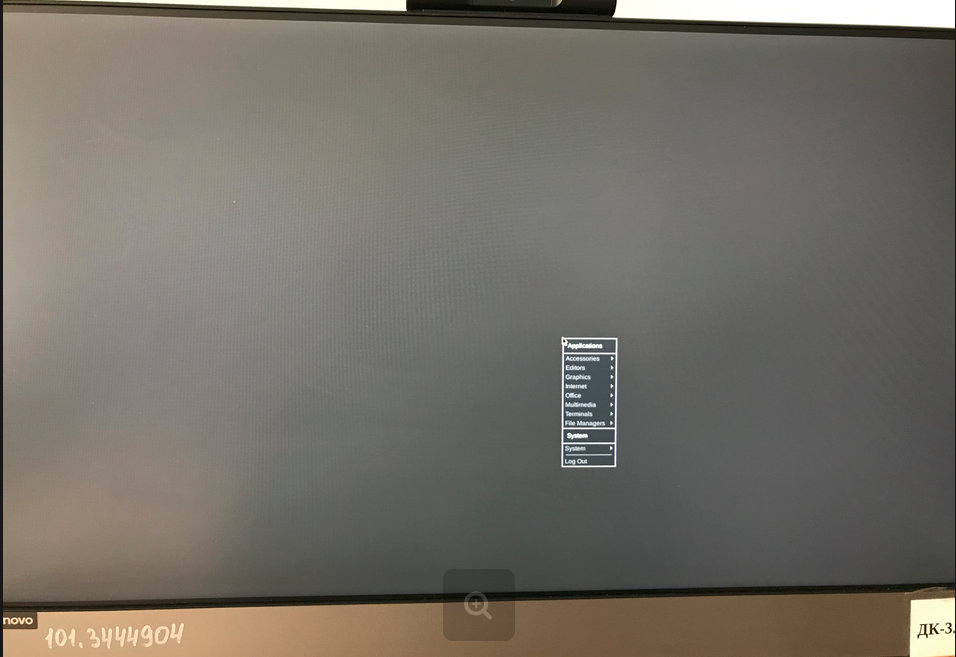

---
# Front matter
lang: ru-RU
title: "Отчёт по лабораторной работе 4 "
subtitle: "Знакомство с операционной системой Linux"
author: "Свояк Валерия Дмитриевна"

# Formatting
toc-title: "Содержание"
toc: true # Table of contents
toc_depth: 2
lof: true # List of figures
lot: true # List of tables
fontsize: 12pt
linestretch: 1.5
papersize: a4paper
documentclass: scrreprt
polyglossia-lang: russian
polyglossia-otherlangs: english
mainfont: PT Serif
romanfont: PT Serif
sansfont: PT Sans
monofont: PT Mono
mainfontoptions: Ligatures=TeX
romanfontoptions: Ligatures=TeX
sansfontoptions: Ligatures=TeX,Scale=MatchLowercase
monofontoptions: Scale=MatchLowercase
indent: true
pdf-engine: lualatex
header-includes:
  - \linepenalty=10 # the penalty added to the badness of each line within a paragraph (no associated penalty node) Increasing the value makes tex try to have fewer lines in the paragraph.
  - \interlinepenalty=0 # value of the penalty (node) added after each line of a paragraph.
  - \hyphenpenalty=50 # the penalty for line breaking at an automatically inserted hyphen
  - \exhyphenpenalty=50 # the penalty for line breaking at an explicit hyphen
  - \binoppenalty=700 # the penalty for breaking a line at a binary operator
  - \relpenalty=500 # the penalty for breaking a line at a relation
  - \clubpenalty=150 # extra penalty for breaking after first line of a paragraph
  - \widowpenalty=150 # extra penalty for breaking before last line of a paragraph
  - \displaywidowpenalty=50 # extra penalty for breaking before last line before a display math
  - \brokenpenalty=100 # extra penalty for page breaking after a hyphenated line
  - \predisplaypenalty=10000 # penalty for breaking before a display
  - \postdisplaypenalty=0 # penalty for breaking after a display
  - \floatingpenalty = 20000 # penalty for splitting an insertion (can only be split footnote in standard LaTeX)
  - \raggedbottom # or \flushbottom
  - \usepackage{float} # keep figures where there are in the text
  - \floatplacement{figure}{H} # keep figures where there are in the text
---

# Цель работы

Познакомиться с операционной системой Linux,получить практические навыки работы с консолью и некоторыми графическими менеджерами рабочих столов операционной системы

# Задание

# Выполнение лабораторной работы

Ознакомиться стеоретическим материалом

{width=70%}

Загрузить компьютер

Перейти на текстовую консоль. Сколько текстовых консолей доступно на вашем ком-пьютере? - **6 текстовых консолей**

Перемещаться между текстовыми консолями. Какие комбинации клавиш необходимо при этом нажимать? **ctrl+alt+f(n) где n в диапазоне от 1 до 6 (6 текстовых консолей)**

{width=70%}

Зарегистрироваться в текстовой консоли операционной системы. Какой логин вы при этом использовали? **свой логин от компьютера vdsvoyak**

Какие символы отображаются при вводе пароля? **не отображаются для сохранения конфиденциальности**

{width=70%}

Завершить консольный сеанс.Какую команду или комбинацию клавиш необходимодля этого использовать? **ctrl+D**

{width=70%}

Переключиться наа графический интерфейс. Какую комбинацию клавиш для этого необходимо нажать? **ctrl+F7**

Ознакомиться с менеджером рабочих столов.Как называется менеджер,запускаемый по умолчанию? -**GNOME**

**Ниже показываю различия в графических мнеджерах; в списке программ визуальные различия (в XFCE) и в нижней вкладке правой (в KDE)**

{width=70%}

{width=70%}

{width=70%}

Поочерёдно зарегистрироваться в разных графических менеджерах рабочих столов(GNOME,KDE,XFCE) и оконных менеджерах (Openbox).Продемонстрировать разницумежду ними, сделав снимки экрана (скриншоты). 

{width=70%}

Какие графические менеджеры установлены на вашем компьютере? **Список визуальных менеджеров прикладываю**

{width=70%}

Изучить список установленных программ. Обратить внимание на предпочтительные программы для разных применений. 

{width=70%}

Mozilla Fifefox

{width=70%}

Geany

{width=70%}

Libreoffice Writer

{width=70%}

терминал

Запустите поочерёдно браузер,текстовой редактор,текстовой процессор,эмулятор консоли. Укажите названия программ. - **Mozilla Fifefox, Geany, Libreoffice Writer, терминал**

# Выводы

Познакомилась с операционной системой Linux,получила практические навыки работы с консолью и некоторыми графическими менеджерами рабочих столов операционной системы

# Контрольные вопросы

1. Компьютерный терминал—устройство ввода–вывода, основные функции которого заключаются в вводе и отображении данных.

С помощью терминала Linux можно сделать всё и даже намного больше, чем в графическом интерфейсе. Благодаря истории команд, автодополнению команд и путей к файлам, поиску по истории, операциям обеднения команд и удобным горячим клавишам, терминалом пользоваться очень удобно, если привыкнуть. А при необходимости можно писать целые скрипты на Bash для автоматизации действий.

2. Что такое входное имя пользователя?

Входное имя пользователя — это login, то есть название учётной записи пользователя. 

3. Учётные записи пользователей хранятся в файле /etc/passwd.

Изначально поле пароля содержало хеш пароля и использовалось для аутентификации. Однако из соображений безопасности все пароли были перенесены в специальный файл /etc/shadow. Они хранятся в виде, недоступном для чтения обычным пользователям. Поэтому в файле /etc/passwd поле password имеет значение x.

4. Где хранятся настройки пользовательских программ?

Настройки пользовательских программ хранятся в домашнем каталоге в папках, начинающихся с точки. 

5. Учётная запись пользователя с UID=0 называется root и присутствует в любой системе типа Linux.

Пользователь root имеет права администратора и может выполнять любые действия в системе.

Работать под учетной записью root следует только тогда, когда это действительно необходимо: при настройке и обновлении системы, восстановлении после сбоев.

6. Имеет ли администратор доступ к настройкам?

Да, полномочия администратора обычно не ограничены. Он может влиять на жизнеспособность самой операционной системы и работу других пользователей

7. Linux — многопользовательская операционная система, т.е. несколько пользователей могут работать с ней одновременно с помощью терминалов.

В многопользовательской модели пользователи делятся на пользователей с обычными правами и администраторов. Пользователь с обычными правами может производить действия с элементами операционной системы только в рамках выделенного ему про- странства и ресурсов, не влияя на жизнеспособность самой операционной системы и работу других пользователей. Полномочия же пользователей с административными правами обычно не ограничены.

Для каждого пользователя организуется домашний каталог, где хранятся его данные и настройки рабочей среды. Доступ других пользователей с обычными правами к этому каталогу ограничивается.

8. Какую информацию кроме пароля и логина содержит учётная запись пользователя?

Кроме пароля и логина учётная запись пользователя содержит:
– внутренний идентификатор пользователя (User ID);
– идентификатор группы (Group ID);
– анкетные данные пользователя (General Information);
– домашний каталог (Home Dir);
– указатель на программную оболочку (Shell).

9. UID, в которой перед “ID” добавлена буква “U”, которая может быть расшифрована как “unique” — “уникальный”, или как “user” — “пользователь”.

Следовательно, есть два варианта расшифровки аббревиатуры UID:
UID (Unique identifier) или УИД — уникальный идентификатор.
UID (User identifier) — идентификатор пользователя в операционной системе или на сайте.

Некоторые идентификаторы являются уникальными, то есть могут принадлежать только одному субъекту (имя может совпадать, а номер паспорта всегда отличается).

Идентификационный номер группы (group ID)

Этот номер (сокращённо GID) обозначает группу, к которой по умолчанию относится пользователь. Группы позволяют регулировать доступ многих пользователей к различным ресурсам.

Каждый пользователь принадлежит одной или нескольким группам, и эту принадлежность устанавливает системный администратор.

10. Что такое GECOS?

GECOS (General Information или GECOS) - анкетные данные пользователя являются необязательным параметром учётной записи и могут содержать реальное имя пользователя
(фамилию, имя), адрес, телефон

11. В домашних каталогах пользователей хранятся пользовательские файлы, а также пользовательские настройки различных программ. Каждый пользователь имеет свой уникальный и неповторимый каталог для своих личных, персональных файлов.

Этот каталог называется Домашним каталогом пользователя и обозначается /home/Имя_Пользователя.

Такое разделение пользовательских каталогов и файлов операционной системы упрощает сохранение данных и повышает надежность самой операционной системы.

12. Как называется ваш домашний каталог?

home 

13. Привилегированный пользователь по умолчанию - root. Эта учетная запись пользователя имеет полный доступ ко всему на сервере Linux и может работать в системном пространстве без ограничений. Учетная запись пользователя root предназначена для выполнения задач системного администрирования и должна использоваться только для этого.

14. Что хранится в файле /etc/passwd?

В файле /etc/passwd хранятся учётные записи пользователя. Однако для безопасности все пароли были перенесены в специальный файл /etc/shadow, недоступный для чтения обычным пользователям. Поэтому в файле /etc/passwd поле password имеет значение x. 

15. Если отрыть и посмотреть содержимое файла /etc/passwd, то можно увидеть, что он состоит из строк, которые начинаются с имени пользователя, после которого через знак двоеточия : следуют ряд текстовых записей. Некоторые записи могут отсутствовать, и тогда двоеточия идут одним за другим.

Всего в одной строке шесть двоеточий, разделяющих семь записей, относящихся к одному пользователю.

В одной строке содержится информация только об одном пользователе.
Так по количеству строк можно определить, сколько всего пользователей зарегистрировано на данной машине.

16. Что такое виртуальные консоли? Как вы думаете, что означает слово «виртуальный»
в данном контексте?

Виртуальные консоли — реализация концепции многотерминальной работы в рамках одного устройства. Виртуальный в данном контексте означает, что у пользователя есть несколько независимых консолей и он имеет возможность переключаться из одной в другую для произведения множества независимых действий.

17. Getty может быть использована системными администраторами для предоставления доступа к другим программам.

18. Что такое сеанс работы?

Сеанс работы -это весь процесс взаимодействия пользователя с системой с момента регистрации до выхода.

19. Toolkit(Tk,«наборинструментов»,«инструментарий»)—кроссплатформенная библиотека базовых элементов графического интерфейса, распространяемая с открытыми исходными текстами.

Используются следующие основные тулкиты:
– GTK+ (сокращение от GIMP Toolkit) — кроссплатформенная библиотека элементов
интерфейса;
– Qt—кроссплатформенный инструментарий разработки программного обеспечения
на языке программирования C++. GTK+ состоит из двух компонентов:
– GTK—содержит набор элементов пользовательского интерфейса (таких,как кнопка, список, поле для ввода текста и т. п.) для различных задач;
– GDK — отвечает за вывод информации на экран, может использовать для этого X Window System, Linux Framebuffer, WinAPI.
На основе GTK+ построены рабочие окружения GNOME, LXDE и Xfce.
Естественно, эти тулкиты могут использоваться и за пределами «родных» десктопных окружений.
Qt используется в среде KDE (Kool Desktop Environment).

20. Какие основные тулкиты существуют в системе Unix?

Основные тулкиты:
1) GTK+ — кроссплатформенная библиотека элементов интерфейса. Она состоит из двух компонентов:
– GTK — содержит набор элементов пользовательского интерфейса для различных задач;
– GDK — отвечает за вывод информации на экран, может использовать для этого
Linux Framebuffer.
2) Qt — кросс-платформенный инструментарий разработки программного обеспечения
на языке программирования C++. Он используется в среде KDE (Kool Desktop Environment).
