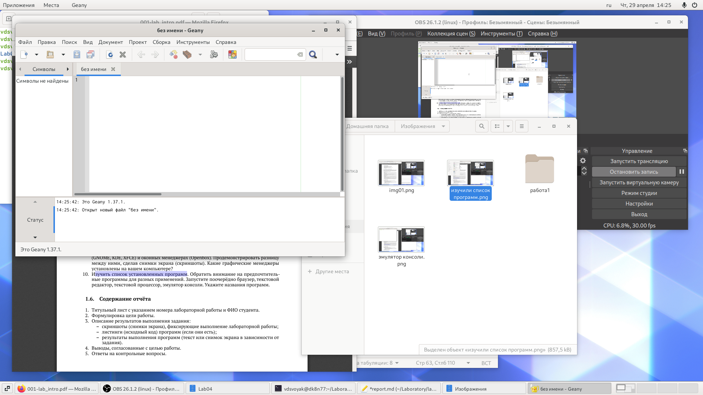

---
# Front matter
lang: ru-RU
title: "Отчёт по лабораторной работе 4 "
subtitle: "Знакомство с операционной системой Linux"
author: "Свояк Валерия Дмитриевна"

# Formatting
toc-title: "Содержание"
toc: true # Table of contents
toc_depth: 2
lof: true # List of figures
lot: true # List of tables
fontsize: 12pt
linestretch: 1.5
papersize: a4paper
documentclass: scrreprt
polyglossia-lang: russian
polyglossia-otherlangs: english
mainfont: PT Serif
romanfont: PT Serif
sansfont: PT Sans
monofont: PT Mono
mainfontoptions: Ligatures=TeX
romanfontoptions: Ligatures=TeX
sansfontoptions: Ligatures=TeX,Scale=MatchLowercase
monofontoptions: Scale=MatchLowercase
indent: true
pdf-engine: lualatex
header-includes:
  - \linepenalty=10 # the penalty added to the badness of each line within a paragraph (no associated penalty node) Increasing the value makes tex try to have fewer lines in the paragraph.
  - \interlinepenalty=0 # value of the penalty (node) added after each line of a paragraph.
  - \hyphenpenalty=50 # the penalty for line breaking at an automatically inserted hyphen
  - \exhyphenpenalty=50 # the penalty for line breaking at an explicit hyphen
  - \binoppenalty=700 # the penalty for breaking a line at a binary operator
  - \relpenalty=500 # the penalty for breaking a line at a relation
  - \clubpenalty=150 # extra penalty for breaking after first line of a paragraph
  - \widowpenalty=150 # extra penalty for breaking before last line of a paragraph
  - \displaywidowpenalty=50 # extra penalty for breaking before last line before a display math
  - \brokenpenalty=100 # extra penalty for page breaking after a hyphenated line
  - \predisplaypenalty=10000 # penalty for breaking before a display
  - \postdisplaypenalty=0 # penalty for breaking after a display
  - \floatingpenalty = 20000 # penalty for splitting an insertion (can only be split footnote in standard LaTeX)
  - \raggedbottom # or \flushbottom
  - \usepackage{float} # keep figures where there are in the text
  - \floatplacement{figure}{H} # keep figures where there are in the text
---

# Цель работы

Познакомиться с операционной системой Linux,получить практические навыки работы с консолью и некоторыми графическими менеджерами рабочих столов операционной системы

# Задание

# Выполнение лабораторной работы

Ознакомиться стеоретическим материалом

{width=70%}

Загрузить компьютер

Перейти на текстовую консоль. Сколько текстовых консолей доступно на вашем ком-пьютере? - **6 текстовых консолей**

Перемещаться между текстовыми консолями. Какие комбинации клавиш необходимо при этом нажимать? **ctrl+alt+f(n) где n в диапазоне от 1 до 6 (6 текстовых консолей)**

{width=70%}

Зарегистрироваться в текстовой консоли операционной системы. Какой логин вы при этом использовали? **свой логин от компьютера vdsvoyak**

Какие символы отображаются при вводе пароля? **не отображаются для сохранения конфиденциальности**

{width=70%}

Завершить консольный сеанс.Какую команду или комбинацию клавиш необходимодля этого использовать? **ctrl+D**

{width=70%}

Переключиться наа графический интерфейс. Какую комбинацию клавиш для этого необходимо нажать? **ctrl+F7**

Ознакомиться с менеджером рабочих столов.Как называется менеджер,запускаемый по умолчанию? -**GNOME**

**Ниже показываю различия в графических мнеджерах; в списке программ визуальные различия (в XFCE) и в нижней вкладке правой (в KDE)**

{width=70%}

{width=70%}

Поочерёдно зарегистрироваться в разных графических менеджерах рабочих столов(GNOME,KDE,XFCE) и оконных менеджерах (Openbox).Продемонстрировать разницумежду ними, сделав снимки экрана (скриншоты). 

{width=70%}

Какие графические менеджеры установлены на вашем компьютере? **Список визуальных менеджеров прикладываю**

{width=70%}

Изучить список установленных программ. Обратить внимание на предпочтительные программы для разных применений. 

{width=70%}

Mozilla Fifefox

{width=70%}

Geany

{width=70%}

Libreoffice Writer

{width=70%}

терминал

Запустите поочерёдно браузер,текстовой редактор,текстовой процессор,эмулятор консоли. Укажите названия программ. - **Mozilla Fifefox, Geany, Libreoffice Writer, терминал**

# Выводы

Познакомилась с операционной системой Linux,получила практические навыки работы с консолью и некоторыми графическими менеджерами рабочих столов операционной системы
