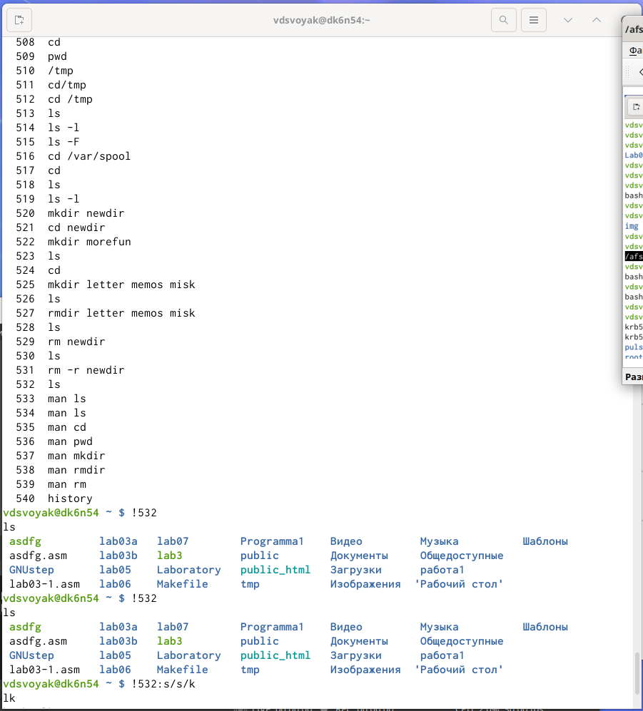

---
## Front matter
lang: ru-RU
title: Основы интерфейса взаимодействия пользователя с системой Unix на уровне командной строки
author: |
	Свояк Валерия Дмитриевна Нби-бд-01-20
institute: |
	RUDN University, Moscow, Russian Federation
date: 
	14 мая 2021

## Formatting
toc: false
slide_level: 2
theme: metropolis
header-includes: 
 - \metroset{progressbar=frametitle,sectionpage=progressbar,numbering=fraction}
 - '\makeatletter'
 - '\beamer@ignorenonframefalse'
 - '\makeatother'
aspectratio: 43
section-titles: true
---

# Лабораторная работа 5

## Цель работы

Приобретение практических навыков взаимодействия пользователя с системой посредством командной строки.

## Слайд 1

1. Определите полное имя вашего домашнего каталога. Далее относительно этого
каталога будут выполняться последующие упражнения.
{width=70%}

## Слайд 2

2. Выполните следующие действия:

2.1. Перейдите в каталог /tmp.

## Слайд 3

2.2. Выведите на экран содержимое каталога /tmp. Для этого используйте команду ls с различными опциями. Поясните разницу в выводимой на экран информации.

{width=70%}

## Слайд 4

{width=70%}

Команда ls выводит содержимое каталога.

Команда ls -l выводит подробный список, в котором будет отображаться владелец, группа, дата создания, размер и другие параметры.

Команда ls -F показывает тип объекта.

## Слайд 5

2.3. Определите, есть ли в каталоге /var/spool подкаталог с именем cron

2.4. Перейдите в Ваш домашний каталог и выведите на экран его содержимое.

## Слайд 6

Определите, кто является владельцем файлов и подкаталогов

{width=70%}

## Слайд 7

3. Выполните следующие действия:

3.1. В домашнем каталоге создайте новый каталог с именем newdir.

3.2. В каталоге ~/newdir создайте новый каталог с именем morefun.

3.3. В домашнем каталоге создайте одной командой три новых каталога с именами letters, memos, misk. Затем удалите эти каталоги одной командой.

## Слайд 8

3.4. Попробуйте удалить ранее созданный каталог ~/newdir командой rm. Проверьте, был ли каталог удалён.

3.5. Удалите каталог ~/newdir/morefun из домашнего каталога. Проверьте,был ли каталог удалён.

{width=70%}

## Слайд 9

4. С помощью команды man определите, какую опцию команды ls нужно использовать для просмотра содержимое не только указанного каталога, но и подкаталогов, входящих в него. (-R, --recursive)

{width=70%}

## Слайд 10

{width=70%}

## Слайд 11

5. С помощью команды man определите набор опций команды ls, позволяющий отсортировать по времени последнего изменения выводимый список содержимого
каталога с развёрнутым описанием файлов. (--time-style; -t; -T; -u)

## Слайд 12

{width=70%}

{width=70%}

## Слайд 13

6. Используйте команду man для просмотра описания следующих команд: cd, pwd,
mkdir, rmdir, rm. Поясните основные опции этих команд.

## Слайд 8

{width=70%}

## Слайд 9

cd

{width=70%}

## Слайд 10

{width=70%}

pwd

## Слайд 11

{width=70%}

mkdir

## Слайд 12

{width=70%}

rmdir

## Слайд 13

rm

{width=70%}

## Слайд 14

Основные опции этих команд:

cd – команда перемещения по файловой системе.

pwd – команда показывающая директорию, в которой находится пользователь.

mkdir – команда, создающая новую директорию.

rmdir – команда, удаляющая файлы, которые должны быть пустыми.

rm - команда, удаляющая файлы или целые деревья каталогов.

## Слайд 15

7. Используя информацию, полученную при помощи команды history

{width=70%}

## Слайд 16

выполните модификацию и исполнение нескольких команд из буфера команд.

## Слайд 17

{width=70%}

## Вывод

Приобрела практические навыки взаимодействия пользователя с системой посредством командной строки.

## Контрольные вопросы

Ответы на контрольные вопросы:

1.Интерфейс командной строки - управление программами с помощью команд. Команды состоят из букв, цифр, символов, набираются построчно, выполняются после нажатия клавиши Enter. Основной инструмент здесь клавиатура. Данный интерфейс встроен в ядро системы, он будет доступен, даже если графический интерфейс не запустится. Добраться до командной строки можно двумя способами: через консоль или терминал.

2.При помощи команды realpath можно определить абсолютный путь текущего каталога. Например, если вбить realpath var на экран выведется /home/<username>/var.

## Контрольные вопросы

3. При помощи команды ls -F можно определить только тип файлов и их имена в текущем каталоге.

4. Файл (или директория) считается скрытым, если его название начинается с символа точка «.». Например, «.myfile». Обычно такие файлы используются приложениями для хранения настроек, конфигураций и другой информации, которую нужно скрыть от пользователя. Зачастую пользователю требуется отредактировать соответствующий конфигурационный скрытый файл, чтобы настроить какую-нибудь программу, и пользователи сталкиваются с тем, что не знают, как их вообще просмотреть. По умолчанию файловые менеджеры обычно не отображают такие файлы.

Для просмотра списка файлов в командной строке используется команда ls. Чтобы по команде ls также выводились скрытые файлы, существует опция -a.

## Контрольные вопросы

5. При помощи команд rm и rmdir можно удалить файл и каталог. Это нельзя сделать одной и той же командой. rmdir используется, чтобы удалить файлы, которые должны быть пустые. rm используется, чтобы удалить непустые файлы или целые деревья каталогов.

6. Определить какие команды выполнил пользователь в сеансе работы можно с помощь команды history.

## Контрольные вопросы

7. Исправить и запустить на выполнение команду, которую пользователь уже использовал в сеансе работы, можно с помощью команды: !<номер_команды>:s/<что_меняем>/<на_что_меняем> Например,

history

.

.

3 ls -a .

.

!3:s/a/F

ls -F

## Контрольные вопросы

8. В одной строке можно записать несколько команд. Если требуется выполнить последовательно несколько команд, записанный в одной строке, то для этого используется символ точка с запятой. Пример: cd; ls.

9. Экранирование — это способ заключения в кавычки одиночного символа. Экранирующий символ (\) сообщает интерпретатору, что следующий за ним символ должен восприниматься как обычный символ. Пример:

echo "Привет" # Привет

echo "Он сказал: \"Привет\"." # Он сказал: "Привет".

## Контрольные вопросы

10. Если используется опция l в команде ls, то на экран выводится подробный список, в котором будет отображаться владелец, группа, дата создания, размер и другая информация о файлах и каталогах.

11. Относительный путь – это путь к файлу относительно текущей папки. При использовании команды pwd на экран выведется относительный путь текущей директории, а при использовании команды realpath на экран выведется абсолютный путь текущей директории.

## Контрольные вопросы

12. Получить информацию об интересующей вас команде можно с помощью команды man. Например, команда man ls выведет все опции команды ls.

13. Сочетание клавиш Ctrl+C прерывает текущий процесс, запущенный в терминале.

## {.standout}

Спасибо за внимание
