---
## Front matter
lang: ru-RU
title: Основы интерфейса взаимодействия пользователя с системой Unix на уровне командной строки
author: |
	Свояк Валерия Дмитриевна Нби-бд-01-20
institute: |
	RUDN University, Moscow, Russian Federation
date: 
	14 мая 2021

## Formatting
toc: false
slide_level: 2
theme: metropolis
header-includes: 
 - \metroset{progressbar=frametitle,sectionpage=progressbar,numbering=fraction}
 - '\makeatletter'
 - '\beamer@ignorenonframefalse'
 - '\makeatother'
aspectratio: 43
section-titles: true
---

# Лабораторная работа 6

## Цель работы

Ознакомление с файловой системой Linux, её структурой, именами и содержанием каталогов. Приобретение практических навыков по применению команд для работы с файлами и каталогами, по управлению процессами (и работами), по проверке использования диска и обслуживанию файловой системы.

## Слайд 1

1. Выполните все примеры, приведённые в первой части описания лабораторной
работы.

Скопировала файл ~/abc1 в файл april и в файл may. 

Скопировала файлы april и may в каталог monthly. 

Скопировала файл monthly/may в файл с именем june. 

Скопировала каталог monthly в каталог monthly.00. 

Скопировала каталог monthly.00 в каталог /tmp.
## Слайд 2

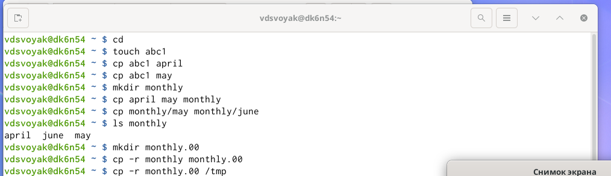{width=70%}

## Слайд 3

Изменила название файла april на july в домашнем каталоге. 

Переместила файл july в каталог monthly.00. 

Переименовала каталог monthly.00 в monthly.01. 

Переместила каталог monthly.01в каталог reports. 

Переименовала каталог reports/monthly.01 в reports/monthly.

## Слайд 4

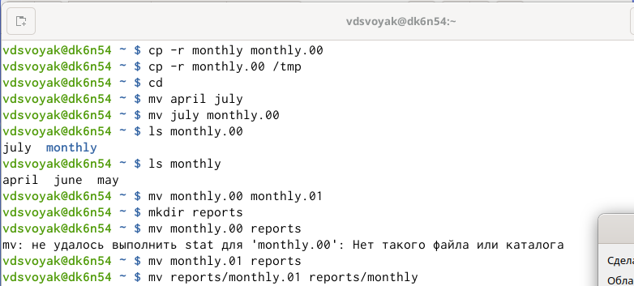{width=70%}

## Слайд 5

Создала файл ~/may с правом выполнения для владельца. 

Лишила владельца файла ~/may права на выполнение. 

Создала каталог monthly с запретом на чтение для членов группы и всех остальных пользователей. 

Создала файл ~/abc1 с правом записи для членов группы.

## Слайд 6

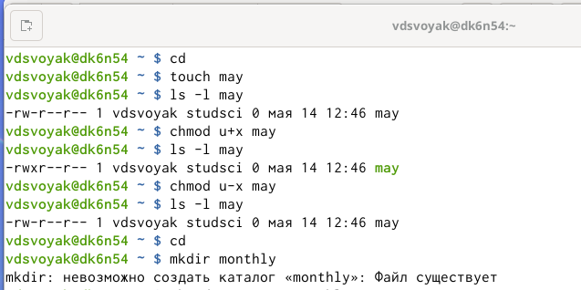{width=70%}

## Слайд 7

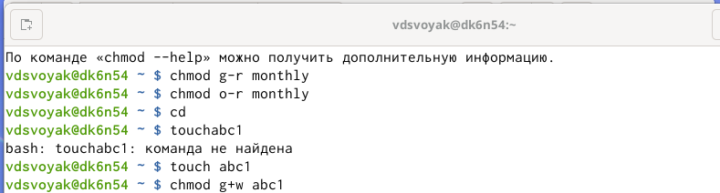{width=70%}

## Слайд 8

Воспользовалась командой df, которая выведет на экран список всех файловых систем в соответствии с именами устройств, с указанием размера и точки монтирования, для определения объёма свободного пространства на файловой системе. С помощью команды fsck проверила целостность файловой системы.

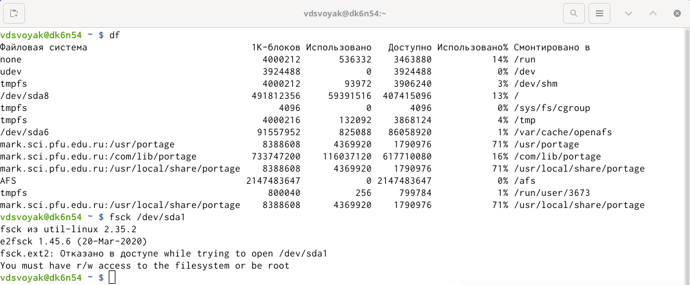{width=70%}

## Слайд 9

2. Выполните следующие действия, зафиксировав в отчёте по лабораторной работе
используемые при этом команды и результаты их выполнения:

2.1. Скопируйте файл /usr/include/sys/io.h в домашний каталог и назовите
его equipment. Если файла io.h нет, то используйте любой другой файл в
каталоге /usr/include/sys/ вместо него.

2.2. В домашнем каталоге создайте директорию ~/ski.plases.

2.3. Переместите файл equipment в каталог ~/ski.plases.

2.4. Переименуйте файл ~/ski.plases/equipment в ~/ski.plases/equiplist.

2.5. Создайте в домашнем каталоге файл abc1 и скопируйте его в каталог
~/ski.plases, назовите его equiplist2.

## Слайд 10

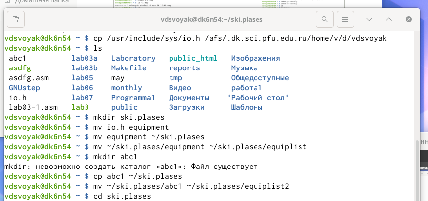{width=70%}

## Слайд 11

2.6. Создайте каталог с именем equipment в каталоге ~/ski.plases.

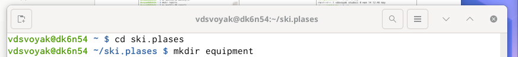{width=70%}

## Слайд 11

2.7. Переместите файлы ~/ski.plases/equiplist и equiplist2 в каталог
~/ski.plases/equipment.

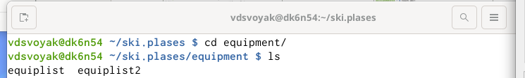{width=70%}

## Слайд 12

2.8. Создайте и переместите каталог ~/newdir в каталог ~/ski.plases и назовите его plans.

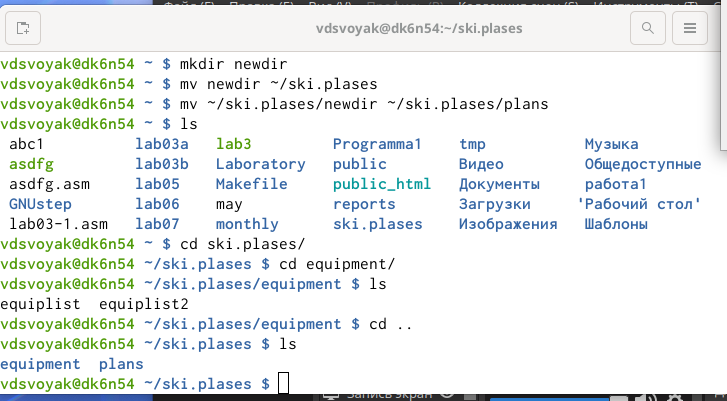{width=70%}

## Слайд 13

3. Определите опции команды chmod, необходимые для того, чтобы присвоить перечисленным ниже файлам выделенные права доступа, считая, что в начале таких прав нет:

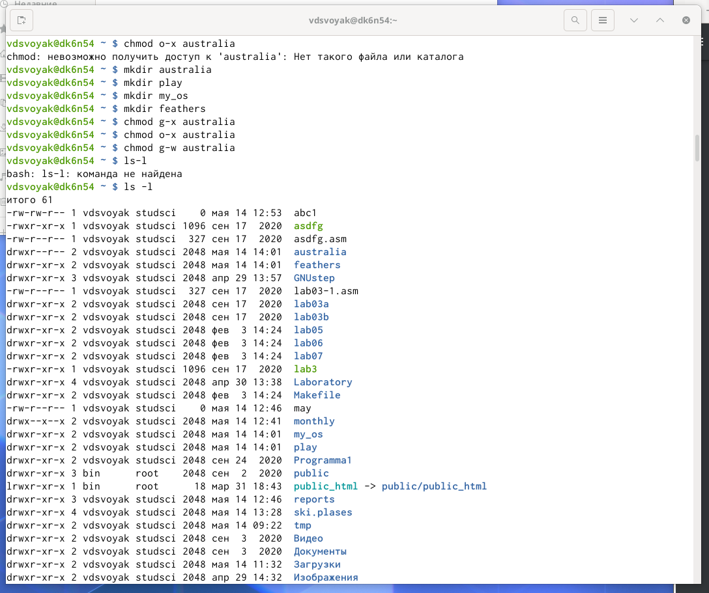{width=70%}

## Слайд 14

3.1. drwxr--r-- ... australia

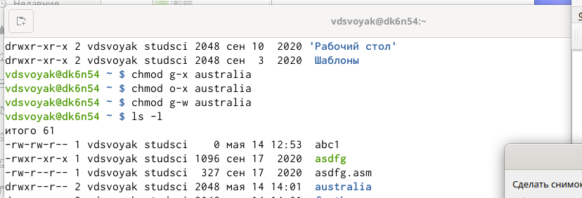{width=70%}

## Слайд 15

3.2. drwx--x--x ... play

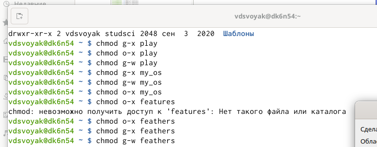{width=70%}

## Слайд 16

3.3. -r-xr--r-- ... my_os

{width=70%}

## Слайд 17

3.4. -rw-rw-r-- ... feathers

При необходимости создайте нужные файлы.

## Слайд 18

4. Проделайте приведённые ниже упражнения, записывая в отчёт по лабораторной
работе используемые при этом команды:

4.1. Просмотрите содержимое файла /etc/password.

## Слайд 19

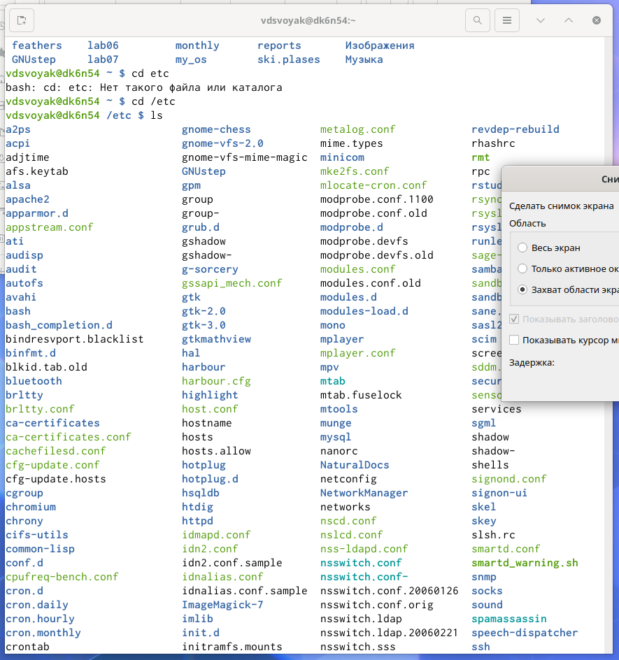{width=70%}

## Слайд 20

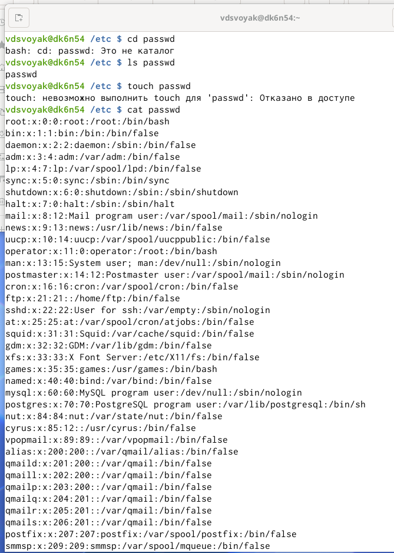{width=70%}

## Слайд 21

4.2. Скопируйте файл ~/feathers в файл ~/file.old.

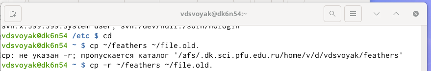{width=70%}

## Слайд 22

4.3. Переместите файл ~/file.old в каталог ~/play.

4.4. Скопируйте каталог ~/play в каталог ~/fun.

4.5. Переместите каталог ~/fun в каталог ~/play и назовите его games.

## Слайд 23

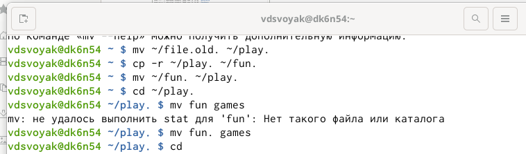{width=70%}

## Слайд 24

4.6. Лишите владельца файла ~/feathers права на чтение.

4.7. Что произойдёт, если вы попытаетесь просмотреть файл ~/feathers командой cat?

4.8. Что произойдёт, если вы попытаетесь скопировать файл ~/feathers?

## Слайд 25

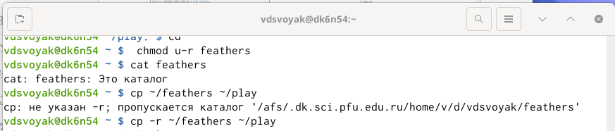{width=70%}

## Слайд 26

4.9. Дайте владельцу файла ~/feathers право на чтение.

{width=70%}

## Слайд 27

4.10. Лишите владельца каталога ~/play права на выполнение.

4.11. Перейдите в каталог ~/play. Что произошло?

4.12. Дайте владельцу каталога ~/play право на выполнение.

## Слайд 28

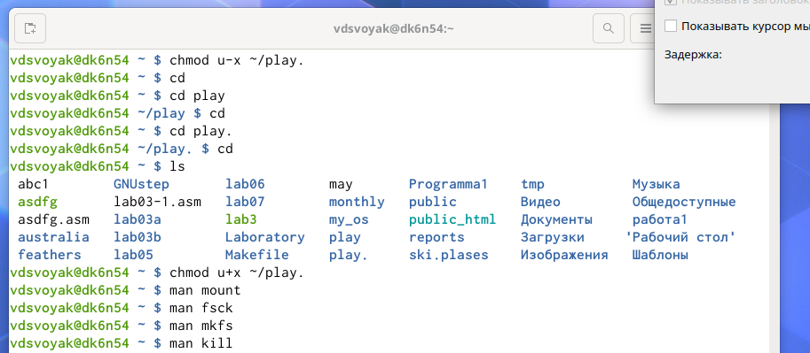{width=70%}

## Слайд 29

5. Прочитайте man по командам mount, fsck, mkfs, kill и кратко их охарактеризуйте, приведя примеры.

## Слайд 30

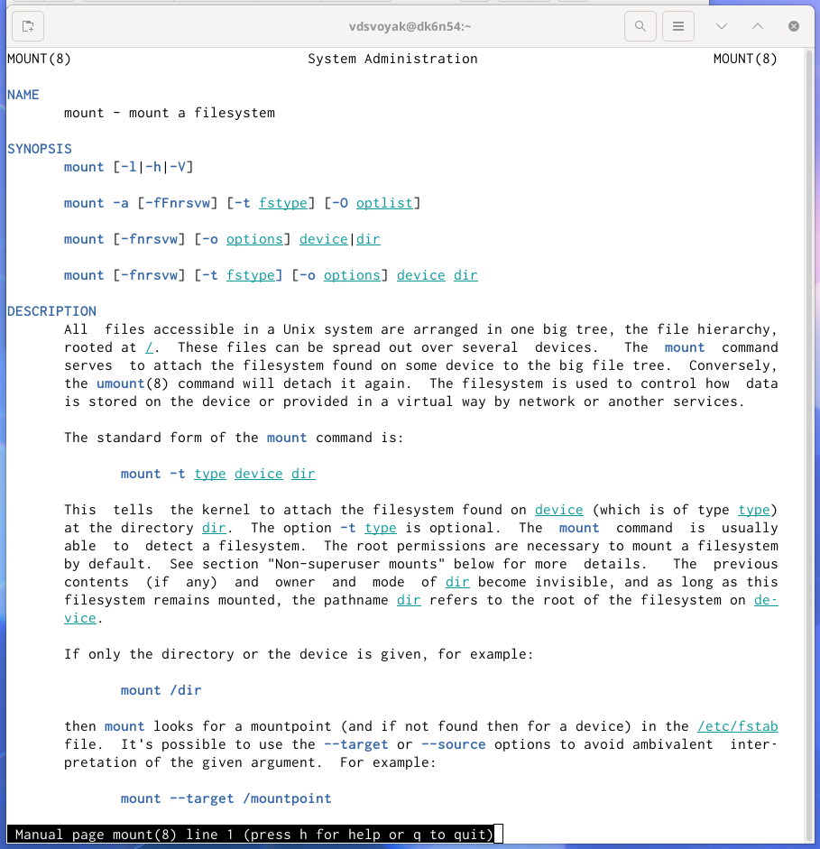{width=70%}

## Слайд 31

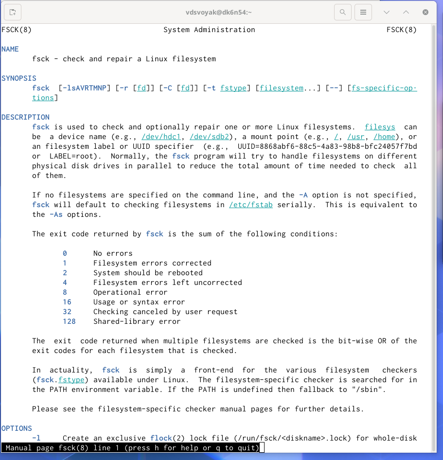{width=70%}

## Слайд 32

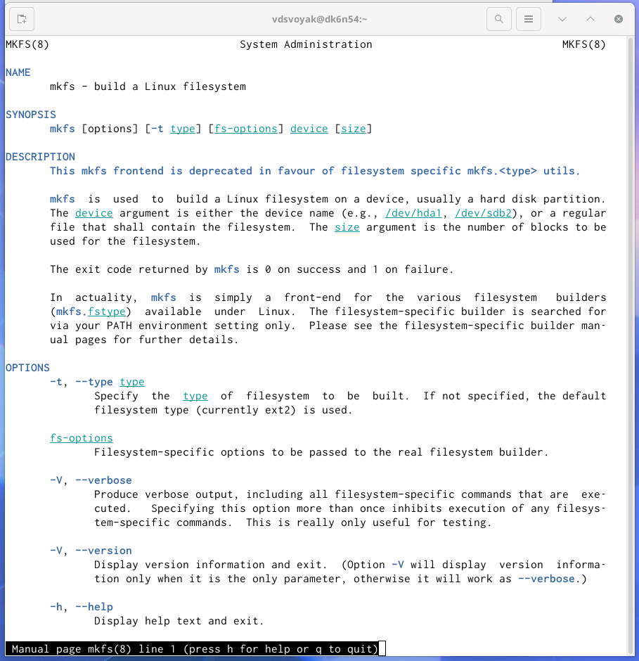{width=70%}

## Слайд 33

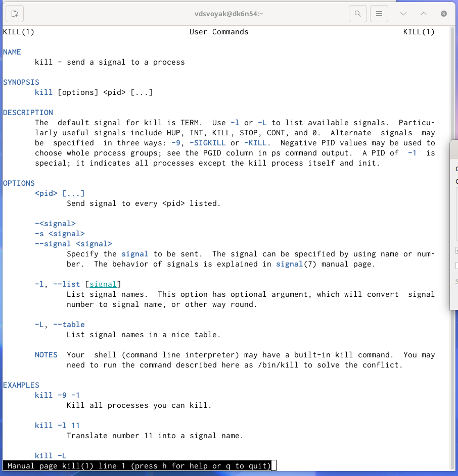{width=70%}

## Слайд 34

Краткая характеристика:

- mount применяется для монтирования файловых систем.

- fsck восстанавливает повреждённую файловую систему или проверяет на целостность.

- mkfs создаёт новую файловую систему.

- kill используется для принудительного завершения работы приложений.

## Вывод

Приобрела практические навыки взаимодействия пользователя с системой посредством командной строки.

## Контрольные вопросы

Ответы на контрольные вопросы:

1.Характеристика файловой системы, которая использовалась в данной лабораторной работе:

Файлы: abc1, april, may, june, july, isdv4.h, equipment, equiplist, equiplist2, my_os, feathers, file.old. Каталоги: monthly, monthly.00, tmp, monthly.01, reports, usr, include, xorg, ski.plases, equipment, newdir, plans, australia, play, etc, fun, games.

2.Пример общей структуры файловой системы: /home/pdarzhankina/monthly/april, где /home/pdarzhankina – домашний каталог, /monthly – каталог, находящийся в домашнем и содержащий файл, /аpril – файл, находящийся в каталоге.

## Контрольные вопросы

3. Чтобы содержимое некоторой файловой системы было доступно операционной системе должно быть выполнено монтирование тома.

4. Основные причины нарушения целостности файловой системы:

- Один блок адресуется несколькими mode (принадлежит нескольким файлам).

- Блок помечен как свободный, но в то же время занят (на него ссылается onode).

- Блок помечен как занятый, но в то же время свободен (ни один inode на него не ссылается).

- Неправильное число ссылок в inode (недостаток или избыток ссылающихся записей в каталогах).

- Несовпадение между размером файла и суммарным размером адресуемых inode блоков.

- Недопустимые адресуемые блоки (например, расположенные за пределами файловой системы).

- "Потерянные" файлы (правильные inode, на которые не ссылаются записи каталогов).

- Недопустимые или неразмещенные номера inode в записях каталогов.

Чтобы устранить повреждения файловой системы используется команда fsck.

## Контрольные вопросы

5. Команда mkfs создаёт новую файловую систему.

6. Характеристика команд, которые позволяют просмотреть текстовые файлы:

- для просмотра небольших файлов удобно пользоваться командой cat.

- для просмотра больших файлов используйте команду less — она позволяет осуществлять постраничный просмотр файлов.

- для просмотра начала файла можно воспользоваться командой head, по умолчанию она выводит первые 10 строк файла.

- команда tail выводит несколько (по умолчанию 10) последних строк файла.

## Контрольные вопросы

7. Основные возможности команды cp:

- копирование файла в текущем каталоге.

- копирование нескольких файлов в каталог.

- копирование файлов в произвольном каталоге.

Опция i в команде cp выведет на экран запрос подтверждения о перезаписи файла, если на место целевого файла вы поставите имя уже существующего файла.

Команда cp с опцией r (recursive) позволяет копировать каталоги вместе с входящими в них файлами и каталогами.

8. Характеристика команд перемещения и переименования файлов и каталогов:

- переименование файлов в текущем каталоге.

mv <старое_название_файла> <новое_название_файла>

- перемещение файлов в другой каталог.

mv <название_файла> <название_каталога>

Если необходим запрос подтверждения о перезаписи файла, то нужно использовать опцию i.

- переименование каталогов в текущем каталоге.

mv <старое_название_каталога> <новое_название_каталога>

## Контрольные вопросы

- перемещение каталога в другой каталог.

mv <старый_каталога> <новый_каталог>

- переименование каталога, не являющегося текущим.

mv <каталог/старое_название_каталога> < каталог/новое_название_каталога>

9. Каждый файл или каталог имеет права доступа: чтение (разрешены просмотр и копирование файла, разрешён просмотр списка входящих в каталог файлов), запись (разрешены изменение и переименование файла, разрешены создание и удаление файлов каталога), выполнение (разрешено выполнение файла, разрешён доступ в

каталог и есть возможность сделать его текущим). Они могу быть изменены командой chmod.

## {.standout}

Спасибо за внимание
