---
## Front matter
lang: ru-RU
title: Анализ файловой системы Linux. Команды для работы с файлами и каталогами
author: |
	Свояк Валерия Дмитриевна Нби-бд-01-20
institute: |
	RUDN University, Moscow, Russian Federation
date: 
	14 мая 2021

## Formatting
toc: false
slide_level: 2
theme: metropolis
header-includes: 
 - \metroset{progressbar=frametitle,sectionpage=progressbar,numbering=fraction}
 - '\makeatletter'
 - '\beamer@ignorenonframefalse'
 - '\makeatother'
aspectratio: 43
section-titles: true
---

# Лабораторная работа 7

## Цель работы

Ознакомиться с инструментами поиска файлов и фильтрации текстовых данных. Приобрести практические навыки: по управлению процессами (и заданиями), по проверке использования диска и обслуживанию файловых систем.

## слайд 1

1. Осуществите вход в систему, используя соответствующее имя пользователя.

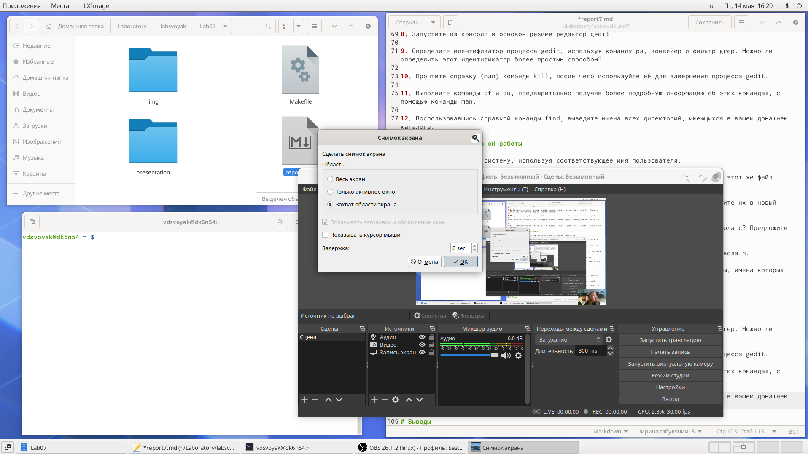{width=70%}

## слайд 2

2. Запишите в файл file.txt названия файлов, содержащихся в каталоге /etc.
Допишите в этот же файл названия файлов, содержащихся в вашем домашнем
каталоге.

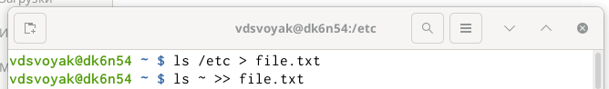{width=70%}

## слайд 3

3. Выведите имена всех файлов из file.txt, имеющих расширение .conf, после
чего запишите их в новый текстовой файл conf.txt.

## слайд 4

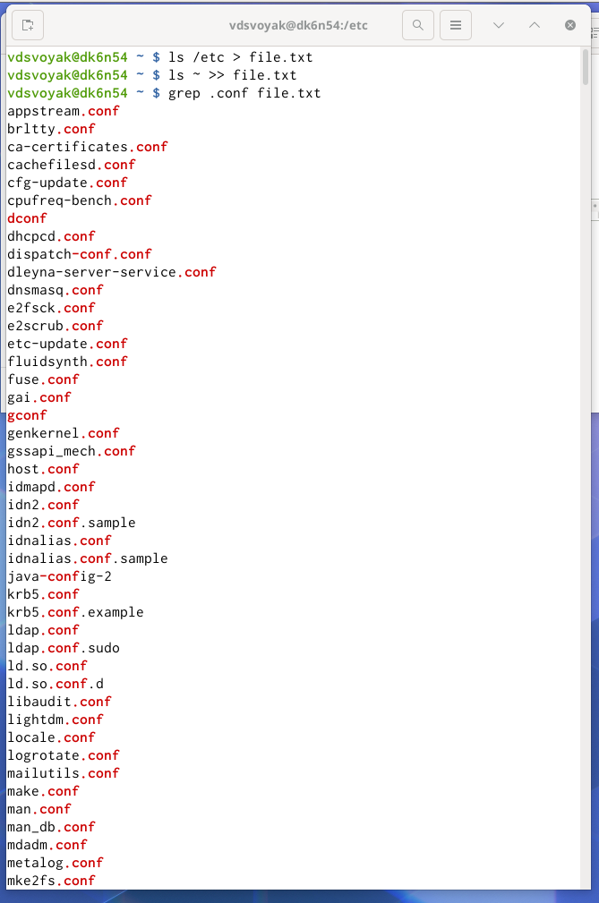{width=70%}

## слайд 5

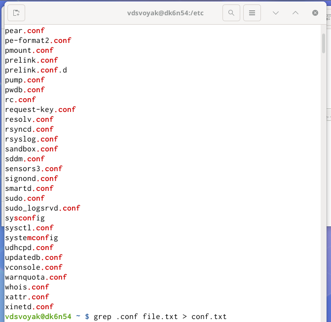{width=70%}

## слайд 6

4. Определите, какие файлы в вашем домашнем каталоге имеют имена, начинавшиеся с символа c? Предложите несколько вариантов, как это сделать.

## слайд 7

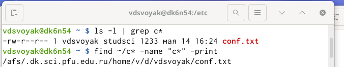{width=70%}

## слайд 8

5. Выведите на экран (по странично) имена файлов из каталога /etc, начинающиеся с символа h.

## слайд 9

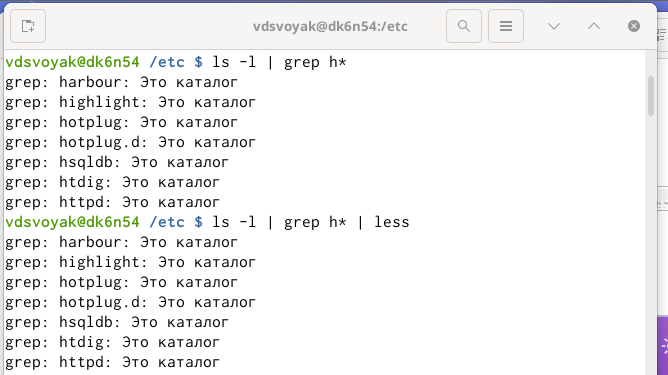{width=70%}

## слайд 10

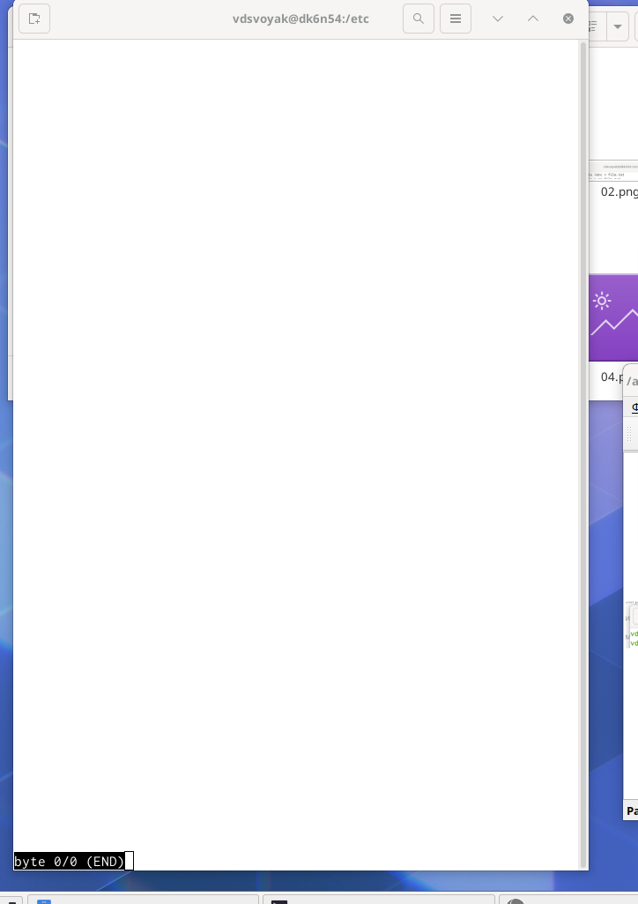{width=70%}

## слайд 11

6. Запустите в фоновом режиме процесс, который будет записывать в файл
~/logfile файлы, имена которых начинаются с log.

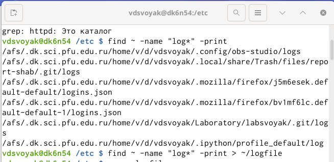{width=70%}

## слайд 12

7. Удалите файл ~/logfile.

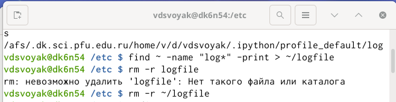{width=70%}

## слайд 13

8. Запустите из консоли в фоновом режиме редактор gedit.

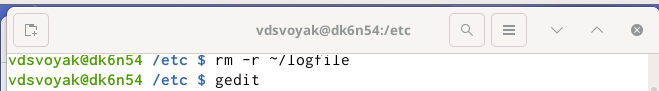{width=70%}

## слайд 14

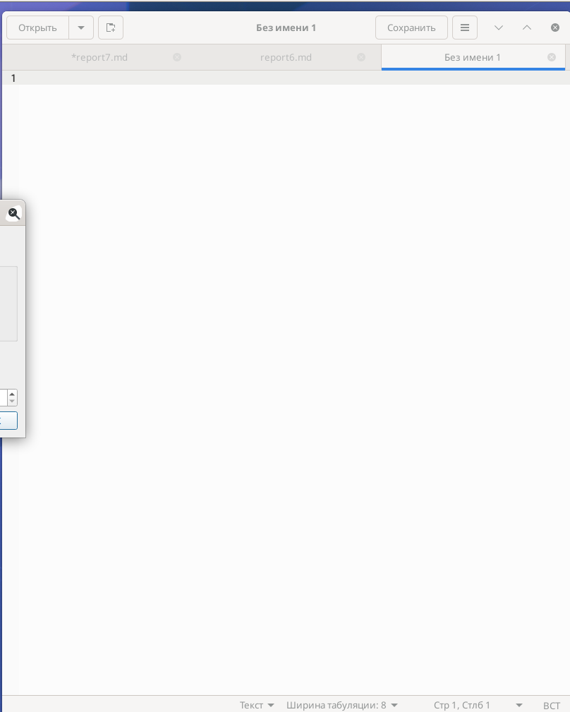{width=70%}

## слайд 15

9. Определите идентификатор процесса gedit, используя команду ps, конвейер и
фильтр grep. Можно ли определить этот идентификатор более простым способом? нет

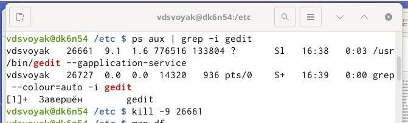{width=70%}

## слайд 16

10. Прочтите справку (man) команды kill, после чего используйте её для завершения процесса gedit.

{width=70%}

## слайд 17 

11. Выполните команды df и du, предварительно получив более подробную информацию об этих командах, с помощью команды man.

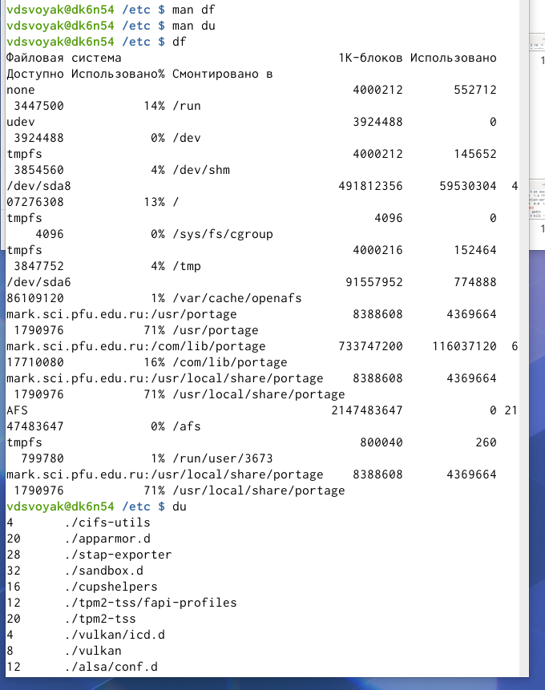{width=70%}

## слайд 18

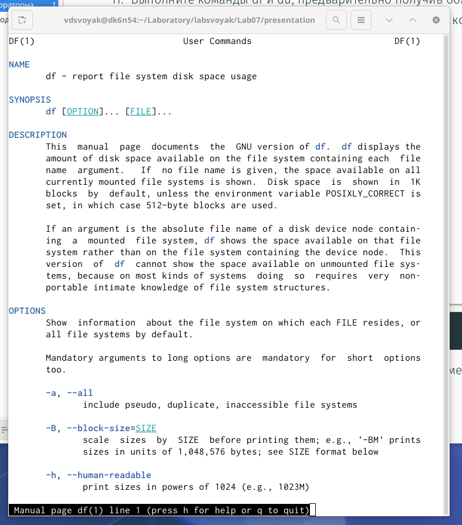{width=70%}

## слайд 19

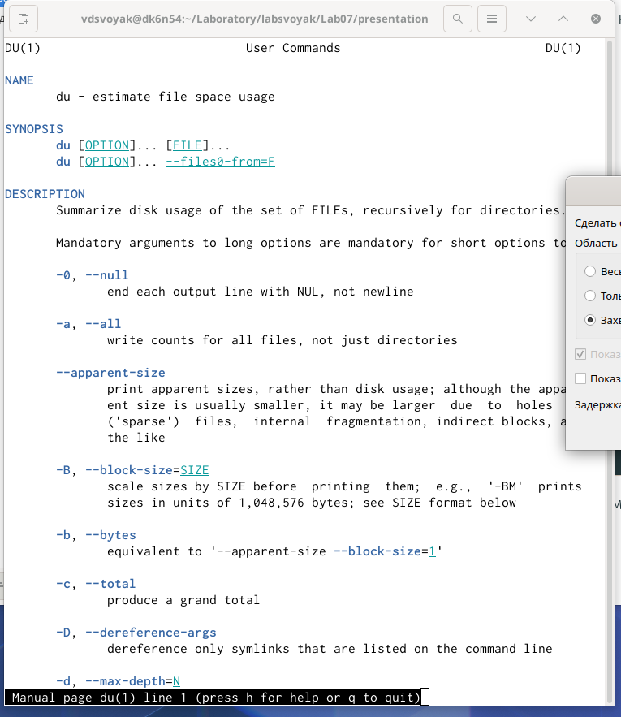{width=70%}

## слайд 20

12. Воспользовавшись справкой команды find, выведите имена всех директорий,
имеющихся в вашем домашнем каталоге.

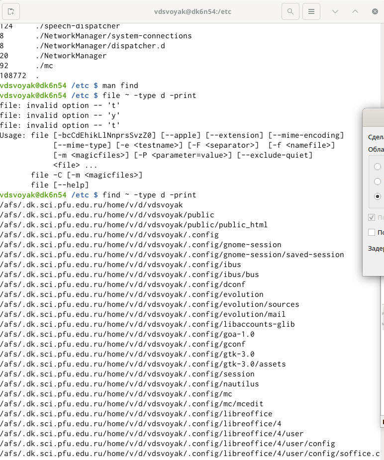{width=70%}

## слайд 21

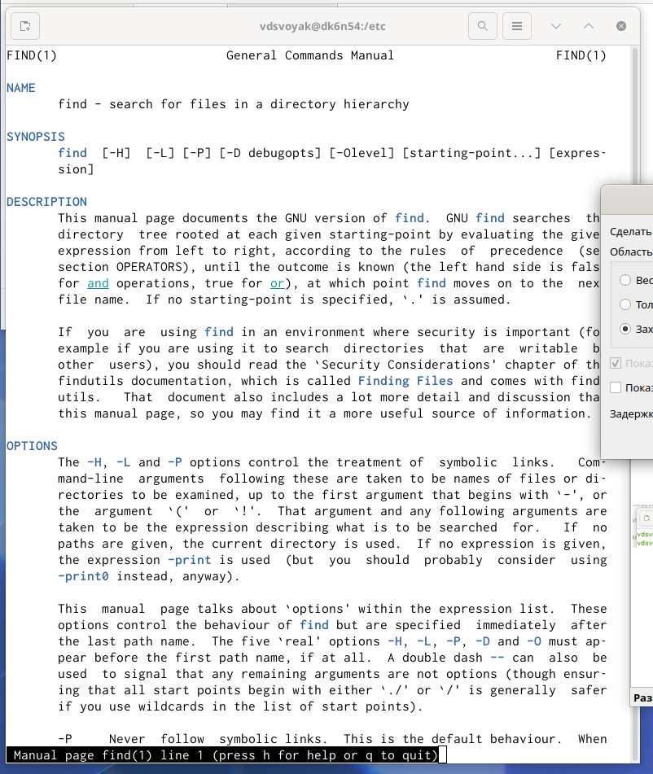{width=70%}

# Выводы

Ознакомилась с инструментами поиска файлов и фильтрации текстовых данных. Приобрела практические навыки: по управлению процессами (и заданиями), по проверке использования диска и обслуживанию файловых систем.

## Контрольные вопросы

Ответы на контрольные вопросы:

1. В системе по умолчанию открыто три специальных потока:

– stdin — стандартный поток ввода (по умолчанию: клавиатура), файловый дескриптор 0;

– stdout — стандартный поток вывода (по умолчанию: консоль), файловый дескриптор 1;

– stderr — стандартный поток вывод сообщений об ошибках (по умолчанию: консоль), файловый дескриптор 2. 

2. > - перенаправление stdout (вывода) в файл. Если файл отсутствовал, то он создаётся, иначе - перезаписывается. >> - перенаправление stdout (вывода) в файл. Если файл отсутствовал, то он создаётся, иначе - добавляется. 

## Контрольные вопросы

3. Конвейер (pipe) служит для объединения простых команд или утилит в цепочки,

в которых результат работы предыдущей команды передаётся последующей.

4. Процесс это - совокупность программного кода и данных, загруженных в память ЭВМ. Любой команде, выполняемой в системе, присваивается идентификатор процесса (process ID). Получить информацию о процессе и управлять им, пользуясь

идентификатором процесса, можно из любого окна командного интерпретатора. Процессом называют выполняющуюся программу и все её элементы: адресное пространство, глобальные переменные, регистры, стек, открытые файлы и так далее.

## Контрольные вопросы

5. PID — уникальный номер (идентификатор) процесса в многозадачной ОС.

GID – идентификатор группы.

6. Любую выполняющуюся в консоли команду или внешнюю программу можно запустить в фоновом режиме. Запущенные фоном программы называются задачами (jobs). Ими можно управлять с помощью команды jobs, которая выводит список запущенных в данный момент задач. Для завершения задачи необходимо выполнить команду kill %номер задачи.

## Контрольные вопросы

7. Команда top в Linux системах позволяет вывести в виде таблицы перечень

запущенных процессов и оценить, какой объем ресурсов они потребляют, т.е., какую нагрузку создают на сервер и дисковую подсистему.

Команда htop — продвинутый монитор процессов, показывает динамический список системных процессов, список обычно выравнивается по использованию ЦПУ. В отличие от top, htop показывает все процессы в системе. Также показывает время непрерывной работы, использование процессоров и памяти. htop часто применяется в тех случаях, когда информации даваемой утилитой top недостаточно, например при поиске утечек памяти в процессах.

## Контрольные вопросы

8. Команда find используется для поиска и отображения имён файлов, соответствующих заданной строке символов. Формат команды: find путь [-опции]

Путь определяет каталог, начиная с которого по всем подкаталогам будет вестись

поиск. Примеры:

- вывести на экран имена файлов из вашего домашнего каталога и его подкаталогов, начинающихся на f: find ~ -name "f*" -print

- вывести на экран имена файлов в каталоге /etc, начинающихся с символа p:

find /etc -name "p*" -print

- найти в вашем домашнем каталоге файлы, имена которых заканчиваются символом и удалить их: find ~ -name "*~" -exec rm "{}" \;

## Контрольные вопросы

9. Найти файл по контексту (содержанию) позволяет команда grep.

Формат команды: grep строка имя_файла

Примеры:

- показать строки во всех файлах в вашем домашнем каталоге с именами, начинающимися на f, в которых есть слово begin: grep begin f*

- найти в текущем каталоге все файлы, в имени которых есть буквосочетание «лаб»:

ls -l | grep лаб

## Контрольные вопросы

10. Определить объем свободной памяти на жёстком диске позволяет команда df.

11. Определить объем домашнего каталога позволяет команда df /home/<user_name>

12. Удалить зависший процесс можно командой kill %номер задачи.

## {.standout}

Спасибо за внимание
